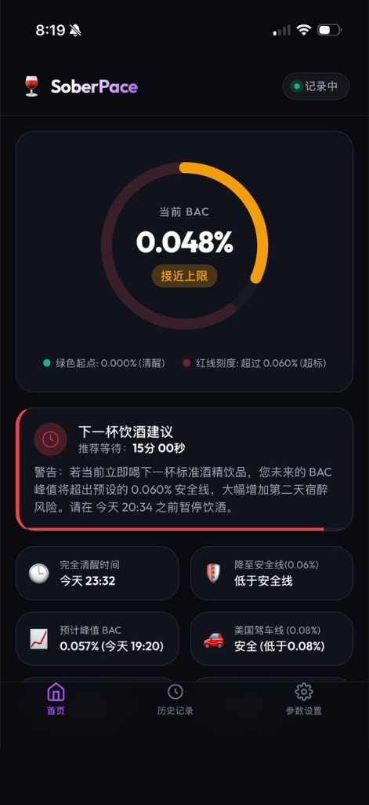
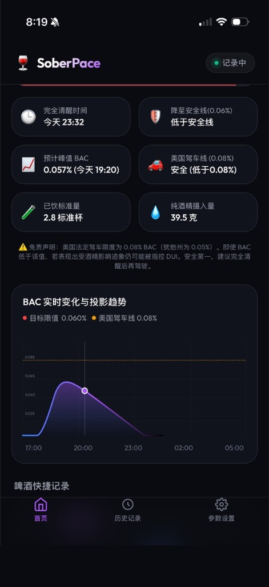
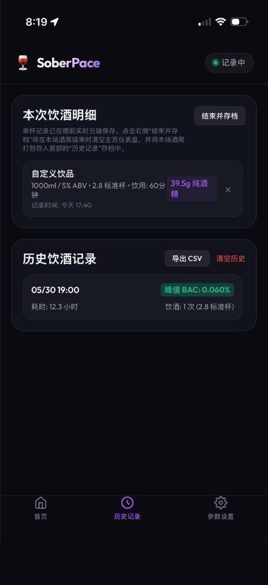
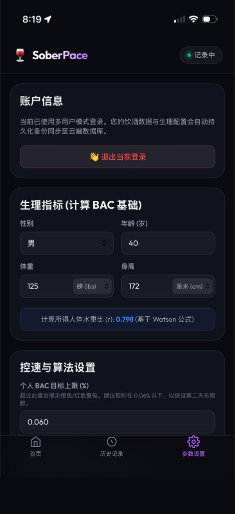

# SoberPace 🍷

**SoberPace** 是一款专为移动端优先设计的实时酒精浓度（BAC）计算与控速助手。通过个性化的生理参数与胃部状态模型，配合先进的 **双室酒精吸收代谢算法**，帮助您在饮酒过程中精准控速，确保 BAC 不超过安全阈值（例如 0.06%），从而避免次日宿醉。

---

## 📱 界面预览

  
  
  
  

---

## 🌟 核心特性

1. **实时 BAC 代谢曲线 & 投影趋势**：
   - 采用个性化 **Watson 公式** 精准计算人体水重比 $r$。
   - 分钟级动态模拟体内血液酒精浓度（BAC），在 SVG 图表上直观渲染未来 6 小时的代谢投影。
2. **饮酒时长估算与双室吸收模型**：
   - 告别传统瞬时吸收模型，引入**线性摄入 $\to$ 胃部残留 $\to$ 小肠吸收 $\to$ 血液**的科学代谢常微分逻辑。
   - 自定义记录支持手动设定 0~90 分钟的慢斟慢饮时长，让计算更贴合真实社交性慢速饮酒过程。
3. **自适应“下一杯”安全预测与倒计时**：
   - 代谢安全智能扫描算法，预测下一次可安全饮酒的时间。
   - **动态探针**：自动根据您酒局中上一杯饮酒的规格（如 500ml 啤酒或 150ml 红酒）进行个性化余量预测，避免因大杯饮用导致 BAC 悄悄突破红线。
4. **啤酒与红酒极速预选双通道**：
   - 支持啤酒（330ml/500ml/Pint）和红酒（75ml/120ml/150ml/200ml）常用杯型与度数的一键快速记录。
   - **智能预选**：自动根据您上一杯的饮酒历史，自动高亮并预选相同的杯型和度数，使续杯记录只需极简的一次点击。
5. **精细化控速徽章与节奏评级**：
   - 按照当前配置的控速时间间隔（如科学控速 80 分钟），在明细列表及历史列表实时评判并标记 `🟢 节奏良好` 或 `🔴 喝太快了`，直观呈现整场酒局的控速达标率百分比。
6. **行车安全警戒线**：
   - 在 BAC 环形仪盘上直观标注 0.08% / 80mg%（犹他州为 0.05% / 50mg%）的 DUI 驾车限制线，保障行车安全。
7. **酒局双向撤销与恢复 (Restore)**：
   - 支持一键撤销（Undo）错误记录的单杯；支持对已结束的“历史存档”进行一键恢复（Restore），还原至首页继续进行续杯。
8. **多用户与隐私安全 PWA**：
   - 采用 Express + SQLite 架构，支持生理参数、饮酒记录云端加密同步。
   - 移动端 PWA 深度适配，支持 PIN 锁屏密码，全面保护您的酒精记录隐私。

---

## 📐 算法原理

### 1. 人体水分比例计算 (Watson 公式)
基于性别、年龄、身高、体重，动态估算人体总水分（TBW），进而得到水重比 $r$（血液酒精浓度与体液酒精浓度的换算系数）：
- **男性**: $TBW = 2.447 - 0.09156 \times \text{age} + 0.1074 \times \text{height} + 0.3362 \times \text{weight}$
- **女性**: $TBW = -2.097 + 0.1069 \times \text{height} + 0.2466 \times \text{weight}$
- **水重比** $r = TBW / (0.8 \times \text{weight})$

### 2. 双室线性吸收方程 (Double-Compartment Kinetics)
设单杯酒的纯酒精量为 $M$，饮酒用时为 $T$（小时），小肠吸收系数为 $k_a$（受胃部饱腹状态影响），$\Delta t$ 为饮酒开始后的流逝时间：
- **饮酒过程中** ($\Delta t \le T$):
  $$A_{\text{absorbed}}(t) = M \left[ \frac{\Delta t}{T} - \frac{1 - e^{-k_a \Delta t}}{k_a T} \right]$$
- **饮酒结束后** ($\Delta t > T$):
  $$A_{\text{absorbed}}(t) = M \left[ 1 - \frac{e^{k_a T} - 1}{k_a T} e^{-k_a \Delta t} \right]$$
- **瞬间吞服** ($T = 0$):
  $$A_{\text{absorbed}}(t) = M \left( 1 - e^{-k_a \Delta t} \right)$$

### 3. 智能推荐饮酒物理间隔算法
系统会使用您的生理指标、代谢率和胃部饱腹状态，在后台模拟连续饮用标准杯（14g 酒精）的曲线。通过多轮循环搜索，计算出**能保证您的 BAC 峰值始终低于安全上限的最小安全时间间隔**。

💡 **完整的微积分常微分方程求解过程、分布系数推导及算法细节，请参阅专门文档**：
👉 **[MATH_EXPLANATION.md (SoberPace 酒精代谢算法与控速原理数学推导)](MATH_EXPLANATION.md)**

---

## 🛠️ 云端运行与安装指南

### 1. 访问线上 App
应用已部署在 Fly.io，可直接在浏览器或手机上访问：
👉 **[https://soberpace.fly.dev/](https://soberpace.fly.dev/)**

---

### 2. 移动端 PWA 安装 (安装成独立 App)
本应用采用 PWA 技术，支持在手机上安装为桌面独立 App，获得原生全屏体验：
- **iOS (Safari 浏览器)**: 
  1. 打开 Safari 浏览器访问 `https://soberpace.fly.dev/`。
  2. 点击底部工具栏的 **分享** 按钮（正方形带向上箭头）。
  3. 向下滑动并选择 **添加到主屏幕**。
- **Android (Chrome 浏览器)**:
  1. 打开 Chrome 浏览器访问 `https://soberpace.fly.dev/`。
  2. 点击右上角菜单按钮，选择 **安装应用**。

---

### 3. 如何部署代码更新？ (自动化 CI/CD)
本项目已在 `.github/workflows/fly-deploy.yml` 配置了 GitHub Actions 自动化部署流程：
- 当您在本地修改并提交代码后，只需运行 **`git push`** 将修改推送到 GitHub 的 `main` 分支。
- GitHub 接收到推送后，会自行在后台启动 CI/CD 工作流进行编译镜像，并将其发布部署至 Fly.io，**无需**在您的本地 Mac 上手动运行 `fly deploy` 命令。

---

### 4. 数据库持久化存储
为了防止重新部署或虚拟机重启时 SQLite 数据丢失，本项目在 Fly.io 配置了 1GB 的加密持久化卷 `soberpace_data`：
- 挂载点为 **/data**
- 数据库路径重定向为 **/data/database.db** (通过 `fly.toml` 环境变量 `DATABASE_PATH` 配置)
- 虚拟机缩容为 1 个实例，完美契合 SQLite 的单写入进程模式，保障数据一致性。
